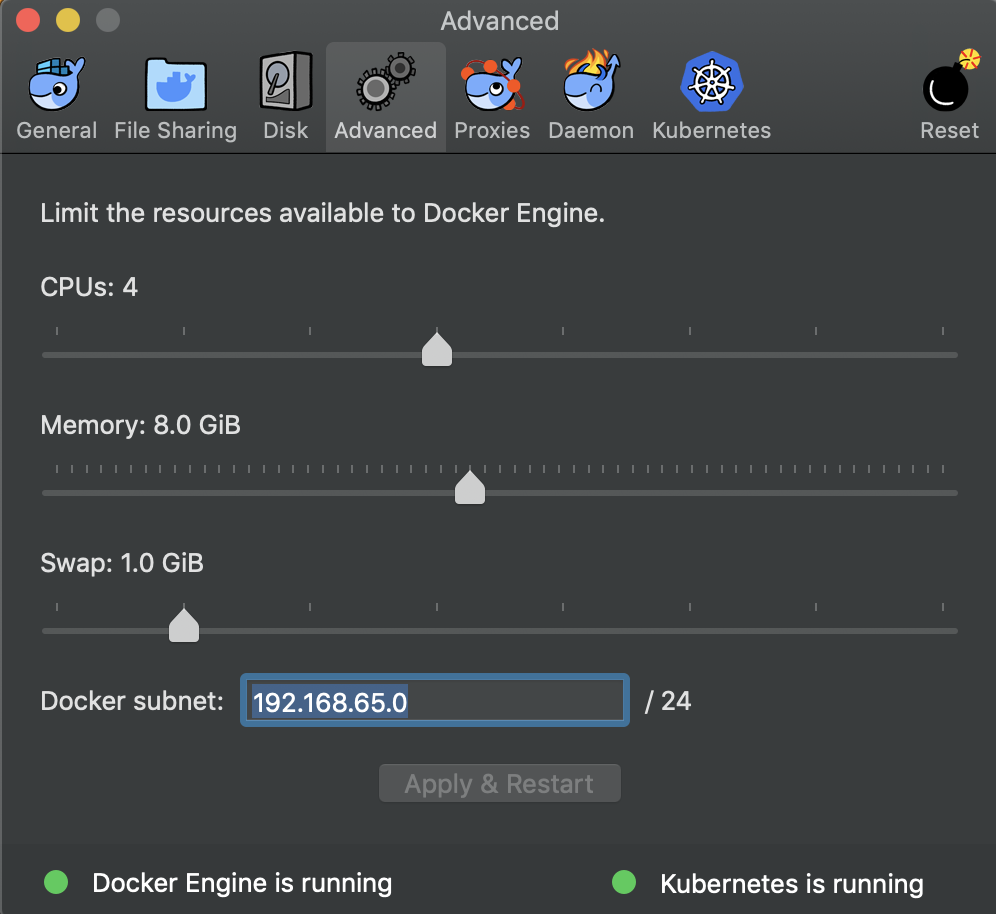

# Sample for DockerCon EU 2018

---

# End-to-End Machine Learning Pipeline with Docker for Desktop and Kubeflow

This project is simple example of an automated end-to-end machine learning pipeline using Docker Desktop and Kubeflow.


## Architecture


### Seldon-Core Architecture


## Getting started

### Requirements:

- [Docker Desktop](https://www.docker.com/products/docker-desktop) for Mac or Windows.
  - Increase the memory configuration from 2GB to 8GB (Preferences->Advanced->Memory).
    <p></p>
- [ksonnet](https://ksonnet.io/#get-started) version 0.11.0 or later.
- [Argo](https://github.com/argoproj/argo/blob/master/demo.md)

### Steps:

#### 1. Build the base image used in the [Argo](https://argoproj.github.io/) workflow

```
$ git clone https://github.com/dockersamples/docker-hub-ml-project
$ cd docker-hub-ml-project
$ cd base && make build; cd ..
```

#### 2. Install [Kubeflow](https://www.kubeflow.org/)

```
$ export BASE_PATH=$(pwd)
$ export KUBEFLOW_TAG=master
$ curl https://raw.githubusercontent.com/kubeflow/kubeflow/master/scripts/download.sh | bash
$ ${BASE_PATH}/scripts/kfctl.sh init ks_app --platform docker-for-desktop
$ cd ks_app
$ ../scripts/kfctl.sh generate k8s
$ ../scripts/kfctl.sh apply k8s
```

Ok, now let's make sure we have everything up and running.

```
# switch to the kubeflow namespace
$ kubectl config set-context docker-for-desktop  --namespace=kubeflow
$ kubectl get pods
(⎈ |docker-for-desktop:kubeflow) ~/d/r/m/p/d/2/d/d/ks_app$ kgp                              16:58:17 ⎇ master
NAME                                             READY     STATUS              RESTARTS   AGE
ambassador-677dd9d8f4-hmwc7                      1/1       Running             0          4m
ambassador-677dd9d8f4-jkmb6                      1/1       Running             0          4m
ambassador-677dd9d8f4-lcc8m                      1/1       Running             0          4m
argo-ui-7b8fff579c-kqbdl                         1/1       Running             0          2m
centraldashboard-f8d7d97fb-6zk9v                 1/1       Running             0          3m
jupyter-0                                        1/1       Running             0          3m
metacontroller-0                                 1/1       Running             0          2m
minio-84969865c4-hjl9f                           1/1       Running             0          2m
ml-pipeline-5cf4db85f5-qskvt                     1/1       Running             1          2m
ml-pipeline-persistenceagent-748666fdcb-vnjvr    1/1       Running             0          2m
ml-pipeline-scheduledworkflow-5bf775c8c4-8rtwf   1/1       Running             0          2m
ml-pipeline-ui-59f8cbbb86-vjqmv                  1/1       Running             0          2m
mysql-c4c4c8f69-wfl99                            1/1       Running             0          2m
spartakus-volunteer-74cb649fb9-w277v             1/1       Running             0          2m
tf-job-dashboard-6b95c47f8-qkf5w                 1/1       Running             0          3m
tf-job-operator-v1beta1-75587897bb-4zcwp         1/1       Running             0          3m
workflow-controller-59c7967f59-wx426             1/1       Running             0          2m
```

If you can see the pods above running, you should be able to access http://localhost:8080/hub to create your Jupyter Notebooks instances.

#### 3. Deploy Seldon-Core's model serving infrastructure

The custom resource definition (CRD) and it's controller is installed using the seldon prototype

```
$ export NAMESPACE=kubeflow
$ cd ks_app
# Gives cluster-admin role to the default service account in the ${NAMESPACE}
$ kubectl create clusterrolebinding seldon-admin --clusterrole=cluster-admin --serviceaccount=${NAMESPACE}:default
# Install the kubeflow/seldon package
$ ks pkg install kubeflow/seldon
# Generate the seldon component and deploy it
$ ks generate seldon seldon --name=seldon
$ ks apply default -c seldon
```

Seldon Core provides an example Helm analytics chart that displays the Prometheus metrics in Grafana. You can install it with:

```
$ helm install seldon-core-analytics --name seldon-core-analytics --set grafana_prom_admin_password=<choose-your-password> --set persistence.enabled=false --repo https://storage.googleapis.com/seldon-charts --namespace kubeflow
```

#### 4. Setup the credentails for the machine learning pipeline

Configure AWS S3 and Docker credentials on your Kubernetes cluster

```
# s3-credentials
$ kubectl create secret generic s3-credentials --from-literal=accessKey=<aws-key> --from-literal=secretKey=<aws-secret>
# docker-credentials
$ kubectl create secret generic docker-credentials --from-literal=username=<username> --from-literal=password=<password>
```

You can upload our sample data located in `base/src/data/hub_stackshare_combined_v2.csv.gz` to your S3 bucket.

#### 5. Submit the Argo worflow

This process will perform the following steps:

- Import data sources
- Process data (clean-up & normalization)
- Split data between training and test datasets
- Training using Keras
- Build and push Docker image using the [Seldon-Core](https://github.com/SeldonIO/seldon-core/blob/master/docs/wrappers/python-docker.md) wrapper
- Deploy the model with 3 replicas

Before submitting the Argo job, make sure you change the parameter values accordingly. You can access the `Argo UI` here: http://localhost:8080/argo/workflows.

**Required fields:**

- `bucket`: S3 bucket name (e.g. `ml-project-2018`)
- `input-data-key`: Path to the S3 input data file (e.g. `data/hub_stackshare_combined_v2.csv.gz`)

Add the Argo `artifactRepository` configuration for S3:

```
$ kubectl edit configmap workflow-controller-configmap
# update the `data` field with the content below
data:
  config: |
    executorImage: argoproj/argoexec:v2.2.0
    artifactRepository:
      s3:
        bucket: docker-metrics-backups
        endpoint: s3.amazonaws.com       #AWS => s3.amazonaws.com; GCS => storage.googleapis.com
        accessKeySecret:                #omit if accessing via AWS IAM
          name: s3-credentials
          key: accessKey
        secretKeySecret:                #omit if accessing via AWS IAM
          name: s3-credentials
          key: secretKey
# save the new configuration and exit vim
$ configmap "workflow-controller-configmap" edited
```

Now let's submit the Argo workflow and monitor its execution from the browser (http://localhost:8080/argo/workflows). You access the artifacts from `step` directly from the `UI`, they are also stored on `S3`.

```
$ cd ${BASE_PATH}
$ argo submit argo_workflow.yaml -p bucket="bucket-test1" -p input-data-key="hub_stackshare_combined_v2.csv.gz"

Name:                docker-hub-classificationmcwz7
Namespace:           kubeflow
ServiceAccount:      default
Status:              Pending
Created:             Fri Nov 30 10:07:53 -0800 (now)
Parameters:
 registry:          <registry-url>
 model-version:     v3
 replicas:          3
 bucket:            <bucket-name>
 input-data-key:    <input-data-key-path>
 docker-cert-key:   <docker-cert-key-path>
 mount-path:        /mnt/workspace/data
 loss:              binary_crossentropy
 test-size:         0.2
 batch-size:        100
 epochs:            15
 validation-split:  0.1
 output-train-csv:  train_data.csv
 output-test-csv:   test_data.csv
 output-model:      hub_classifier.h5
 output-vectorized-descriptions: vectorized_descriptions.pckl
 output-raw-csv:    hub_stackshare_combined_v2.csv
 selected-categories: devops,build-test-deploy,languages & frameworks,data stores,programming languages,application hosting,databases,web servers,application utilities,support-sales-and-marketing,operating systems,monitoring tools,continuous integration,self-hosted blogging / cms,open source service discovery,message queue,frameworks (full stack),in-memory databases,crm,search as a service,log management,monitoring,collaboration,virtual machine platforms & containers,server configuration and automation,big data tools,database tools,machine learning tools,code collaboration & version_control,load balancer / reverse proxy,web cache,java build tools,search engines,container tools,package managers,project management,infrastructure build tools,static site generators,code review,microframeworks (backend),assets and media,version control system,front end package manager,headless browsers,data science notebooks,ecommerce,background processing,cross-platform mobile development,issue tracking,analytics,secrets management,text editor,graph databases,cluster management,exception monitoring,business tools,business intelligence,localhost tools,realtime backend / api,microservices tools,chatops,git tools,hosted package repository,js build tools / js task runners,libraries,platform as a service,general analytics,group chat & notifications,browser testing,serverless / task processing,css pre-processors / extensions,image processing and management,integrated development environment,stream processing,cross-platform desktop development,continuous deployment,machine learning,data science,monitoring metrics,metrics,continuous delivery,build automation
```

> All the Argo workflow parameters can be overwritten via the CLI using the `-p` flag.

## Repo Layout

```
.
├── README.md
├── argo_workflow.png
├── argo_workflow.yaml
└── base
    ├── Dockerfile
    ├── Makefile
    ├── requirements.txt
    └── src
        ├── data
        │   └── hub_stackshare_combined_v2.csv.gz
        ├── fetch_gihub_data.py
        ├── models
        │   ├── DockerHubClassification.py
        │   └── requirements.txt
        ├── process_data.py
        └── train.py
```

## Open Source Projects Used

#### [Ambassador](https://www.getambassador.io/)

API Gateway based on envoy proxy. It allows you to do self-service publishing and canary deployments.

#### [Tensorflow](https://www.tensorflow.org/)

Machine learning framework

#### [Jupyter Hub](https://jupyterhub.readthedocs.io/en/stable/)

Multi-user server for Jupyter notebooks

#### [Seldon Core](https://www.seldon.io/)

Platform for deploying ML models

#### [Argo](https://argoproj.github.io/)

Container-native workflow management (CI/CD)

#### [Prometheus](https://prometheus.io/)

Moriting & Alerting platform

#### [Grafana](https://grafana.com/)

Open platform for analytics and monitoring. It provides the UI for data visualization.

#### [Kubernetes](https://kubernetes.io/)

Open-source system for automating deployment, scaling, and management of containerized applications.
